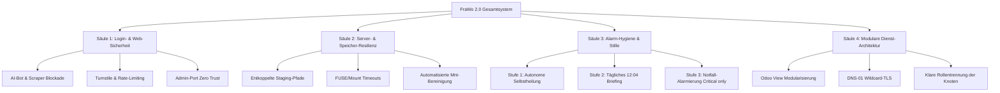

# FraWo 2.0 — Server-, Sicherheits- & Infrastruktur-Gesamtkonzept

**Version:** 2.0-Master  
**Stand:** 17.09.2026  
**Status:** In Umsetzung (Phase 2 nach Bugfix-Baseline)  
**Geltungsbereich:** Gesamte FraWo-IT (Anker-PVE, ProDesk/stock-pve, UCG Ultra, Cloudflare, alle VMs/LXCs)

---

## 1. Ausgangslage & Zielsetzung (Wolfs Direktive)

> **Klarstellung 17.09.2026:**  
> *„FraWo 2.0 wurde missverständlicherweise als 'nur Radio' interpretiert. Ich meine den gesamten Server ... die Schwachstellen identifizieren, auch Sicherheit ... gibt noch keine AI-Sperre für den Login z.B. ... und FraWo 2.0 entwickeln, damit wir endlich sauber arbeiten und ich nicht ständig mit Problemen zugetextet werde.“*

Bislang führten Agenten Task #1488 fälschlicherweise als reines Radio-Konzept („FraWo.funk V2“). Das Radio ist jedoch lediglich ein Endnutzer-Dienst. **FraWo 2.0 ist das fundamentale Betriebs-, Sicherheits- und Resilienz-Upgrade der gesamten Server-Landschaft.**

### Kernziele von FraWo 2.0:
1. **Wasserfeste Sicherheit:** Schutz aller Login-Endpunkte gegen AI-Scraper, Brute-Force und Credential Stuffing.
2. **Architektur-Resilienz:** Keine D-State-Hänger, keine blockierenden FUSE-/ZFS-Cgroups, saubere Mount-Timeouts.
3. **Absolute Stille für Wolf:** Trennung zwischen automatischer Selbstheilung, täglichem Lagebericht (12:04 Uhr) und echten Notfall-Alarmen. Keine Alarm-Kaskaden (1 statt 15 Nachrichten), keine Warnings aufs Smartphone.
4. **Wartbarkeit & Modularität:** Beseitigung monolithischer Altlasten (z.B. Odoo View 3353), automatisierte Zertifikate und klare Dienst-Isolierung.

---

## 2. Schwachstellen-Audit (Bestandsaufnahme)

| Bereich | Schwachstelle im Ist-Zustand | Risiko | FraWo 2.0 Maßnahme |
|---|---|---|---|
| **Web-Logins** | Odoo `/web/login`, Vaultwarden, HA ohne Bot-/AI-Schutz | Automatisierte Wörterbuch-Angriffe, AI-Crawler-Last | Cloudflare WAF AI-Bot-Sperre + Turnstile Managed Challenge |
| **Admin-Panels** | Proxmox (8006), PBS (8007), Grafana, Portainer | Unnötige Angriffsfläche bei Fehlkonfiguration | Strikte Isolation (ausschließlich VLAN 101 / Tailscale / WireGuard) |
| **Mounts & Storage** | Dienste hängen ungepuffert an Netzwerk- und USB-Mounts | USB-Ausfall friert Systemd-Cgroups im D-State ein | Lokale SSD-Staging-Pfade (`/var/tmp`), strikte Systemd-Timeouts (`TimeoutSec=30`) |
| **Alarmierung** | Watchdogs und Prometheus feuern bei transienten Fehlern | Alarm-Abstumpfung bei Wolf durch Spam | 3-Ebenen-Filter: Selbstheilung → 12:04 Lagebericht → Nur Critical per Telegram |
| **Dienst-Code** | Monolithische Views (Odoo View 3353: 94k Zeichen Inline) | Schwer wartbar, anfällig für Regressions | Aufteilung in modulare QWeb-Komponenten |
| **TLS/Zertifikate** | Selbstsignierte Zertifikate auf internen Diensten | Browser-Warnungen, unsichere API-Calls | Wildcard-Zertifikate (`*.frawo.tech`) via Let's Encrypt / Cloudflare DNS-01 |

---

## 3. Die 4 Säulen von FraWo 2.0



---

### Säule 1: Login-Sicherheit & KI/Bot-Abwehr

#### 1. AI-Scraper & Crawler-Sperre (Cloudflare WAF)
- **Problem:** AI-Bots (OpenAI GPTBot, Anthropic ClaudeBot, ByteDance Bytespider, Common Crawl CCBot, PerplexityBot) scannen Webseiten und Logins aggressiv ab.
- **Umsetzung:**
  - In Cloudflare: Aktivierung des **AI Scraper Blocking** (One-Click Rule) für die Zone `frawo.tech`.
  - Zusätzliche Custom WAF-Regel für alle sensiblen Subdomains (`odoo.frawo.tech`, `vault.frawo.tech`, `funk.frawo.tech`, `cloud.frawo.tech`):
    ```text
    (cf.client.bot) or (http.user_agent contains "GPTBot") or (http.user_agent contains "ClaudeBot") or (http.user_agent contains "Bytespider")
    => ACTION: BLOCK (403)
    ```

#### 2. Brute-Force & Credential-Stuffing Schutz (Turnstile & Rate Limits)
- **Problem:** Direkte POST-Requests gegen `/web/login` (Odoo) oder `/api/v1/users/login` (Vaultwarden).
- **Umsetzung:**
  - **Cloudflare Managed Challenge / Turnstile:**
    Pfadbasierte Challenge für `/web/login*` und Authentifizierungs-Endpunkte. Menschliche Nutzer bemerken fast keine Verzögerung; automatisierte Skripte werden an der Edge abgewiesen.
  - **Nginx Rate-Limiting auf CT140:**
    ```nginx
    limit_req_zone $binary_remote_addr zone=odoo_login:10m rate=5r/m;
    location /web/login {
        limit_req zone=odoo_login burst=5 nodelay;
        proxy_pass http://odoo_backend;
    }
    ```
  - **Fail2ban:** Überwachung von Nginx 401/403 und Odoo-Login-Fehlern (`Login failed for db:FraWo_GbR`). Ban-Dauer: 24 Stunden nach 5 Fehlversuchen.

#### 3. Zero Trust & Admin-Port Isolation
- Proxmox Web (8006), PBS (8007), Grafana (3000), Prometheus (9090), Portainer:
  **Niemals öffentlich über Cloudflare Tunnels ohne Cloudflare Zero Trust / Access Auth routen.** Standardzugriff nur über LAN (VLAN 101) oder Tailscale Workstation-Mesh.

---

### Säule 2: Server- & Speicher-Resilienz

#### 1. Entkopplung von Staging und Backup-Medien
- **Lektion aus Task #1462 / #1481:**
  Dienste dürfen Staging- und Zwischenspeicher niemals auf Wechselspeicher oder USB-ZFS (`/anker-backup`) legen.
- **Standard:**
  - Temporäre Staging-Ordner liegen zwingend auf `/var/tmp/` (lokale NVMe/SSD des Hosts).
  - Skripte prüfen vor Schreibvorgängen mit `timeout 5s` die Schreibbarkeit des Ziels. Scheitert der Test, bricht der Job laut ab, statt im Kernel-D-State zu verharren.

#### 2. Systemd Unit-Härtung
- Alle Backup- und Wartungs-Units erhalten:
  ```ini
  [Service]
  TimeoutStartSec=7200
  TimeoutStopSec=60
  SendSIGKILL=yes
  KillMode=mixed
  ```
  Verhindert, dass hängende Kindprozesse Systemd-Units tagelang blockieren.

#### 3. Aufräumen verwaister Mounts
- Prüfung und Bereinigung toter Mount-Definitionen (z.B. `/mnt/radio_rw` auf VM 210, Altlasten in `/etc/fstab`).

---

### Säule 3: Alarm-Hygiene & Stille ("Nicht ständig zugetextet werden")

Das Ziel ist ein System, das sich selbst repariert und Wolf nur dann kontaktiert, wenn **physisches menschliches Eingreifen unumgänglich ist**.

```text
[Ereignis tritt auf]
       │
       ▼
┌──────────────────────────────┐
│ Stufe 1: Autonome Reparatur  │ ──► Gelöst? ──► Fertig. Völlige Stille.
│ (Systemd-Restart, Watchdog)   │
└──────────────────────────────┘
       │ Nein
       ▼
┌──────────────────────────────┐
│ Handlungsbedarf sofort?       │ ──► Nein ──► Fließt in täglichen 12:04 Lagebericht.
└──────────────────────────────┘
       │ Ja (Kernsystem tot / Hardware-Ausfall)
       ▼
┌──────────────────────────────┐
│ Stufe 3: Notfall-Alarm       │ ──► Genau 1 Telegram-Nachricht an Wolf.
│ (Severity: Critical only)    │     Keine Kaskaden, kein Flapping.
└──────────────────────────────┘
```

#### Konkrete Regeln:
1. **Keine Warnungen aufs Smartphone:** Telegram erhält ausschließlich `severity: critical`. Alle `warning`-Alarme landen im Grafana-Dashboard und im 12:04-Bericht.
2. **Strikte Alertmanager-Deduplizierung:**
   - `group_by: ['alertname']`
   - `group_wait: 30s`
   - `group_interval: 5m`
   - `repeat_interval: 12h` (Kein Wiederholen derselben Meldung alle 15 Minuten!).
3. **Selbstüberwachung:** Prometheus überwacht Alertmanager, Alertmanager überwacht Prometheus (`absent()`-Regeln).

---

### Säule 4: Saubere Codebasis & Dienst-Modularität

#### 1. Entflechtung Odoo View 3353 (Website / Radio)
- Aufteilung des 94.000 Zeichen Inline-Monolithen in separate QWeb-Sub-Templates (`assets/src/js/player.js`, `views/radio_templates.xml`).
- Konsolidierung der 5 redundanten Timer in eine einzige State-Engine.

#### 2. Saubere TLS/SSL-Infrastruktur
- Interne Dienste nutzen keine selbstsignierten Zertifikate mehr.
- Zertifikatsbereitstellung zentral über Cloudflare Origin Certificates bzw. Let's Encrypt DNS-01 Challenge für interne Adressen (`*.internal.frawo.tech`).

---

## 4. Phasenplan & nächste Schritte

| Phase | Maßnahmen | Status |
|---|---|---|
| **Phase 1: Bugs** | • Stromabrechnung Stockenweiler (Task #1487)<br>• Odoo-Offsite-Backup Entkopplung (Task #1481)<br>• Watchdog-Endlosschleife bereinigen | **✅ Abgeschlossen / Verifiziert** |
| **Phase 2.1: WAF & KI-Sperre** | • Cloudflare AI-Bot Blocking aktivieren<br>• Turnstile / Managed Challenge auf Login-URLs schalten<br>• Rate-Limiting an Nginx konfigurieren | **Bereit zur Ausführung** |
| **Phase 2.2: Resilienz & Storage** | • Timeouts für Systemd-Units standardisieren<br>• Tote Mounts (VM 210) bereinigen<br>• ZFS-Pool Reaktivierung nach Wolfs USB-Check (#1462) | **In Vorbereitung** |
| **Phase 2.3: Alarm-Entstörung** | • Alertmanager Regeln & Mute-Filter härten<br>• 12:04 Lagebericht als alleiniges Info-Format festigen | **In Vorbereitung** |
| **Phase 2.4: Dienst-Refactoring** | • Odoo View 3353 entflechten & modularisieren<br>• Radio V2 Architektur vollenden | **Audit läuft (Jarvis)** |
