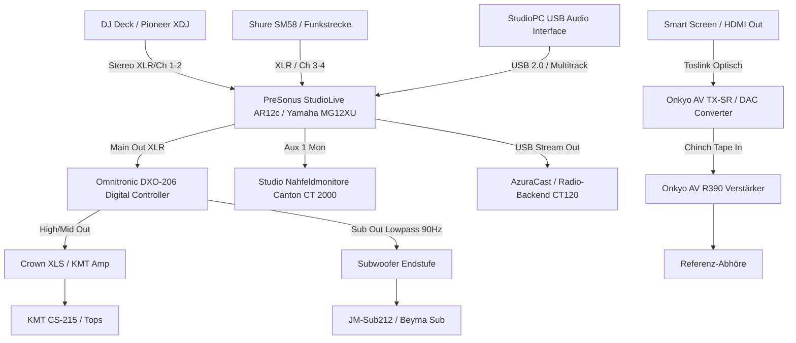

# Studio Audio & Video Signalplan / Patchplan

Systematischer Signal-, Geräte- & Routingplan für Studio, Event-Zentrale & Audio-Kuration (Tasks #1107 & #1108).

---

## 🎙️ 1. Audio-Signalfluss (Studio & Live-Regie)

---

## 🔌 2. Detaillierte Patch- & Kabelzuordnung (Task #1107)

| Port / Kanal | Gerät / Quelle | Ziel-Gerät | Kabeltyp / Stecker | Pegel / Signalart |
|---|---|---|---|---|
| **Ch 1 & 2** | Pioneer DJ Deck Master 1 | StudioLive AR12c In 1-2 | 2× XLR symmetrisch (3m) | Line (+4 dBu) |
| **Ch 3** | DJ Mikrofon (Shure SM58) | StudioLive AR12c In 3 | XLR fem -> XLR male (5m) | Mic Level (Gain +32 dB) |
| **Ch 4** | Gäste- / Funkmikrofon | StudioLive AR12c In 4 | XLR fem -> XLR male (5m) | Mic Level (Gain +28 dB) |
| **Ch 9/10 (Stereo)** | StudioPC Media Playback | StudioLive AR12c Stereo In | USB 2.0 / USB-B Audio | Digital PCM 24bit/48kHz |
| **Main Out L/R** | StudioLive AR12c Master Out | Omnitronic DXO-206 In A/B | 2× XLR symmetrisch (1.5m) | Line (+4 dBu) |
| **Out 1/2 (DSP)** | Omnitronic DXO-206 High/Mid | Endstufe 1 (Tops) | 2× XLR patch (0.5m) | HPF 100 Hz 24dB/Okt |
| **Out 3/4 (DSP)** | Omnitronic DXO-206 Subwoofer | Endstufe 2 (Bässe) | 2× XLR patch (0.5m) | LPF 95 Hz 24dB/Okt |
| **Optical In** | Smart Screen / TV Optical | Onkyo TX-SR / AV R390 | Toslink LWL (2m) | S/PDIF Stereo PCM |
| **HDMI 1-3** | StudioPC GPU / NDI Capture | Smart Screen HDMI In | HDMI 2.1 High-Speed (2m) | 4K 60Hz + Audio |

---

## 🎛️ 3. Kalibrierung, Gain-Staging & Geräteeinstellungen (Task #1108)

1. **Gain Staging Richtlinie:**
   - **DJ Deck:** Master Level auf nominal 0 dB (LED-Kette grün, Peaks gelb bei maximal +3 dB, kein Rot).
   - **StudioLive AR12c:** Input Trim so einpegeln, dass Signal-LEDs konstant grün leuchten. Main Fader auf Unity (0 dB).
   - **DSP (Omnitronic DXO-206):** Input Gain 0.0 dB. Output Limiter gesetzt auf -1.5 dBFS zum Schutz der Hochtöner.
2. **Lautsprecher-Frequenzweiche & EQ:**
   - **KMT Tops:** High-Pass Butterworth 24 dB/Okt bei 95 Hz.
   - **Subwoofer (JM-Sub212):** Low-Pass Linkwitz-Riley 24 dB/Okt bei 90 Hz, Subsonic-Filter bei 35 Hz (18 dB/Okt).
   - **Canton CT 2000 Nahfeld:** Linearer Studio-Modus über Onkyo Direct / Pure Audio.
3. **Kabel-Beschriftung:**
   - Alle Studio- & Rack-Kabel sind an beiden Enden farbcodiert und mit transparentem Schrumpfschlauch dauerhaft markiert (`[QUELLE] -> [ZIEL]`).
