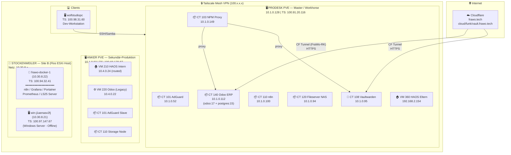

> ⚠️ **TEILWEISE VERALTET.** Aktueller Live-Stand: **[NOW.md](NOW.md)**. Kern-Korrekturen: frawo-docker-1 = VMware-VM auf **Flos** Host (kein HW-Zugriff; Wolfs Eltern = Testkunden). Echte Subnetze: Rothkreuz 10.1.0.0/24 + 10.3.0.0/24 (Radio-DMZ), Stockenweiler-ESXi 10.30.8.0/24. Domain = **frawo.tech** (nicht frawo-tech.de).

# FraWo GbR — Infrastruktur-Karte
**Stand: 2026-06-17 | Verifiziert durch Live-Check**

## Übersicht



---

## Storage-Architektur

- **ProDesk local-lvm**: Speicherpool für Container (CT 101-140) auf ProDesk.
- **Samba Fileserver (CT 120)**: Stellt das Musikarchiv (`music`) und Scanner-Ablagen (`scans`) im Netzwerk unter `\\10.1.0.94` zur Verfügung.
- **Google Drive**: Synchronisation mit `gdrive:` erfolgt über rclone vom Storage-Node.
- **ssd2tb (Anker)**: ⚠️ **Achtung: Physisch nicht vorhanden!** Inactive/Phantom-Config, keine Datensicherungen dorthin schreiben.

---

## Datenfluss: Dokumente

```
Eingang → Scanner/Upload → Samba scans Share (CT 120)
                             ↓ rclone (alle 5 Min)
                         Paperless-ngx (Legacy VM 330 / Neu TBD)
                             ↓ OCR + Archivierung
                         Nextcloud-Archiv (frawo.tech)
```

---

## Was noch fehlt / offen

| Problem | Prio | Fix | Status |
|---|---|---|---|
| Windows VM offline | 🔴 | Flo muss die Windows Server VM auf dem ESXi starten. | Ausstehend |
| Odoo Repatriierung abschließen | 🔴 | DNS-Einträge von `frawo.tech` auf den ProDesk CT 140 Tunnel umleiten. | In Arbeit |
| Radio Konsolidierung | 🟡 | Medienspeicher CT 120 mit AzuraCast CT 141 verbinden und Playlisten synchronisieren. | Ausstehend |
| PBS Backups einrichten | 🟡 | Datensicherung auf dem ProDesk PBS (CT 109) aktivieren (ohne ssd2tb). | Ausstehend |

---

*Verifiziert: 2026-06-17 — Live-Check der ProDesk- und Anker-Topologie durch Antigravity.*
