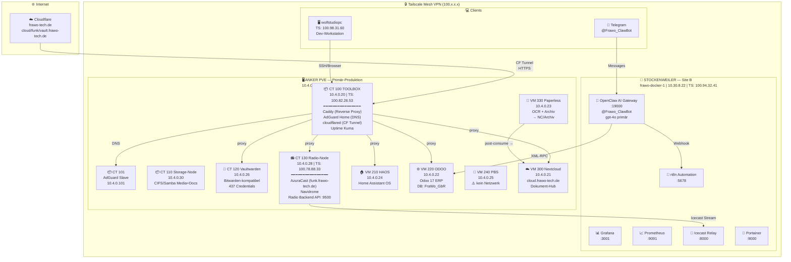
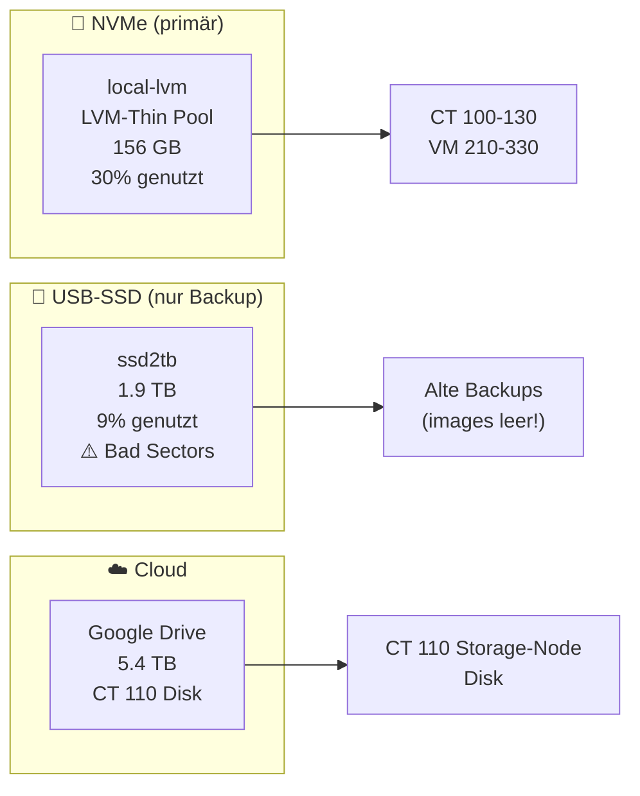

> ⚠️ **TEILWEISE VERALTET.** Aktueller Live-Stand: **[NOW.md](NOW.md)**. Kern-Korrekturen: frawo-docker-1 = VMware-VM auf **Flos** Host (kein HW-Zugriff; Wolfs Eltern = Testkunden). Echte Subnetze: Rothkreuz 10.1.0.0/24 + 10.3.0.0/24 (Radio-DMZ), Stockenweiler-ESXi 10.30.8.0/24, ProDesk/Easybox 192.168.2.0/24 (NICHT 10.4.0.x). Domain = **frawo.tech** (nicht frawo-tech.de).

# FraWo GbR — Infrastruktur-Karte
**Stand: 2026-05-30 | Verifiziert durch Live-Check**

## Übersicht



---

## Storage-Architektur (Anker PVE)



---

## Datenfluss: Dokumente

```
Eingang → cloud.frawo-tech.de/Dokumente/Eingang
             ↓ rclone (alle 5 Min, VM 330 cron)
         Paperless consume_dir (VM 330)
             ↓ OCR + Klassifizierung
         Paperless DB + paperless-to-nc.sh
             ↓
         cloud.frawo-tech.de/Dokumente/Archiv/{Korrespondent}/{Jahr}/
```

## Datenfluss: Radio

```
FraWo Musikarchiv (CT 110 Samba) → AzuraCast (CT 130)
                                       ↓ Icecast Stream :8000
                                   frawo-docker-1 Icecast-Relay
                                       ↓ CF Tunnel
                                   funk.frawo-tech.de (öffentlich)
```

---

## Was noch fehlt / offen

| Problem | Prio | Fix |
|---------|------|-----|
| PVE Firewall nicht aktiv | 🔴 | PVE Web UI → Datacenter → Firewall |
| VM 240 PBS kein Netzwerk | 🟡 | VNC Console → Netzwerk konfigurieren |
| Anthropic API kein Guthaben | 🟡 | console.anthropic.com → Billing |
| Tailscale Subnet Route nicht approved | 🟡 | admin.tailscale.com → proxmox-anker → approve |
| OpenClaw Email Channel fehlt | 🟢 | agent@frawo-tech.de IMAP/SMTP konfigurieren |

---

*Verifiziert: 2026-05-30 — Live-Check aller Services durch Claude Sonnet 4.6 + Wolf*
